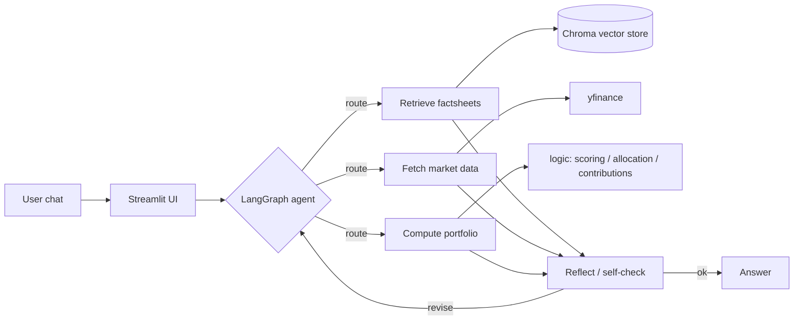

# Agentic RAG Robo-Advisor

A chat-based investment advisor. You talk through your goal and how much risk
you're comfortable with, and it builds an ETF portfolio for you — with the
reasoning tied back to real fund data instead of made up by the model.

The idea is a split brain: the language model runs the conversation, but the
parts that actually matter for money — scoring, allocation, the risk maths — are
plain, deterministic Python that's unit-tested. Every recommendation also cites
the fund factsheets it leaned on, so you can see where a number came from.

It started as a bachelor-thesis prototype. I rebuilt it into a proper agentic RAG
application to work through the architecture from the
[IBM RAG and Agentic AI Professional Certificate](https://www.coursera.org/professional-certificates/ibm-rag-and-agentic-ai)
on a real use case rather than a toy one.

## What it does

- Learns your profile one question at a time: goal, time horizon, risk tolerance,
  ESG preference, and how much you want to put in.
- Computes volatility, max drawdown and Sharpe ratio from real price history
  (`yfinance`) — no hard-coded "risk = 8" integers anywhere.
- Retrieves the relevant fund factsheets and makes the model cite them, so a claim
  about a fund can be traced back to a source instead of taken on trust.
- Handles each turn through a LangGraph state machine that routes the query,
  fetches data or documents as needed, and runs one self-check pass before it
  answers.
- Takes follow-ups in plain language ("make it a bit less risky") and re-balances.

## Architecture



The layers stayed cleanly separated from the thesis version onward:

| Layer | Package | Responsibility |
|-------|---------|----------------|
| UI | `ui/` | Streamlit chat + recommendation rendering |
| Agent | `agent/` | LangGraph graph, tools, state (routing + reflection) |
| RAG | `rag/` | Ingest factsheets → Chroma, retriever with citations |
| Data | `data_sources/` | `yfinance` wrapper, risk-metric calculations |
| Core | `logic/` | Pure, deterministic scoring / allocation / contributions |
| LLM | `llm/` | Multi-provider model factory + prompts |

### IBM course mapping

If you're checking this against the certificate, here's where each topic actually
lives in the code:

| Course topic | Where it lives |
|---|---|
| RAG pipeline, Chroma/FAISS, chunking | `rag/ingest.py`, `rag/retriever.py` |
| Agentic RAG with query routing | `agent/graph.py` (route node) |
| ReAct / Reflection architectures | `agent/graph.py` (reflect node + loop) |
| LangGraph state machines | `agent/graph.py`, `agent/state.py` |
| MCP / FastMCP servers | `mcp_server/server.py` |
| Evaluation & LLM-as-judge | `eval/extraction.py`, `eval/judge.py` |

## Getting started

```bash
# 1. Create and activate a virtual environment
python -m venv venv
# Windows:  .\venv\Scripts\activate
# macOS/Linux:  source venv/bin/activate

# 2. Install (editable, with the extras you want)
pip install -e ".[providers,rag,mcp,dev]"

# 3. Configure secrets
cp .env.example .env      # then fill in your provider API key

# 4. Build the RAG corpus + vector store (optional but recommended —
#    enables cited, grounded recommendations)
python -m rag.build_docs   # generates fund profiles from live market data
python -m rag.ingest       # chunks + embeds them into chroma_db/

# 5. Run
streamlit run app.py
```

### How grounding works

Official factsheets and KIIDs are copyrighted, so I don't ship them. Instead
`rag/build_docs.py` writes one Markdown profile per ETF from data the project can
legally reproduce: live fundamentals plus computed 5-year risk metrics, with an
as-of date. `rag/ingest.py` chunks those documents (paragraph-aware, with the
fund title prefixed onto each chunk so a stray risk-metrics passage still says
which fund it describes) and embeds them with Chroma's built-in local ONNX MiniLM
model — no API key, no torch install. If you have real PDF factsheets, drop them
into `data/factsheets/` and the ingest step picks them up too. At answer time the
app pulls the passages behind each recommended fund and the model has to cite them
by number; the UI lists those passages in a Sources panel.

### Choosing an LLM provider

One env var picks the model — no code change:

```env
LLM_MODEL=google_genai:gemini-2.5-flash   # or anthropic:claude-sonnet-5, openai:gpt-4o-mini, ...
```

### MCP server

The same data, risk and RAG functions the agent uses internally are also exposed
as a standalone Model Context Protocol service (`mcp_server/server.py`), so any
MCP client — Claude Desktop, another agent, an IDE — can call them without pulling
in this codebase.

```bash
# stdio transport (the default MCP wiring)
python -m mcp_server.server

# or over HTTP for quick manual testing
python -m mcp_server.server --transport streamable-http
```

It exposes `get_prices`, `compute_risk_metrics`, `list_universe`,
`target_volatility`, `plan_contributions` and `retrieve_factsheet`. To wire it
into Claude Desktop, add this to `claude_desktop_config.json`:

```json
{
  "mcpServers": {
    "robo-advisor": {
      "command": "python",
      "args": ["-m", "mcp_server.server"],
      "cwd": "/absolute/path/to/investment_bot_neu"
    }
  }
}
```

### Evaluation harness

The LLM side is measured rather than eyeballed. `eval/` holds a labelled set of
chat transcripts paired with the `UserProfile` they should produce, plus an
LLM-as-judge pass that grades recommendation explanations on grounding, relevance,
clarity and safety.

```bash
python -m eval.run              # profile-extraction accuracy (per-field + overall)
python -m eval.run --judge      # + LLM-as-judge over live recommendations
```

Extraction hits the model once per case; the judge pass runs the full advisor
graph end to end and grades each explanation 1–5. The scoring logic itself (field
comparison, aggregation, judge parsing) is pure and unit-tested, so CI can verify
the harness without an API key.

## Deploying a public demo

The repo is ready to deploy on Streamlit Community Cloud (or anything that runs
`streamlit run app.py` off a `requirements.txt`). Three things make a public demo
survivable and cheap:

- **Snapshot data instead of live calls.** Yahoo blocks datacenter IPs, so the
  deployed app reads `data/universe_snapshot.json` — a committed snapshot of the
  enriched ETF universe — rather than hitting `yfinance` on every cold start.
  Regenerate it locally with `python -m data_sources.snapshot`, or set
  `USE_LIVE_DATA=1` to prefer live metrics. If a live fetch fails, it falls back
  to the snapshot on its own.
- **Bring your own key.** The public instance ships no shared key, so strangers
  can't burn through the owner's quota. A sidebar panel takes the visitor's own
  key (Google / Anthropic / OpenAI); it stays in their session and goes straight
  to the provider, never into a shared env var. Until a key is entered, a saved
  example recommendation is shown so the app isn't blank.
- **Grounding survives the deploy.** `chroma_db/` is gitignored, so the app
  rebuilds the vector store from the committed factsheets on first boot. A small
  SQLite shim (`rag/_compat.py` + `pysqlite3-binary`, Linux only) covers hosts
  whose system SQLite is too old for Chroma.

To deploy: point Streamlit Community Cloud at `app.py` and it installs from
`requirements.txt`. Add an owner key under App → Settings → Secrets
(`GOOGLE_API_KEY = "…"`) if you want live chat without BYOK; otherwise leave it
out and visitors bring their own.

## Development

```bash
pytest            # run the test suite
ruff check .      # lint
ruff format .     # format
```

## Disclaimer

This is an educational project, not financial advice. Don't act on anything it
produces without talking to a licensed professional first.

## License

MIT — see [LICENSE](LICENSE).
