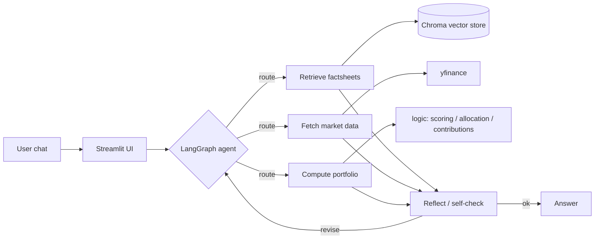

# 🤖 Agentic RAG Robo-Advisor

A chat-based investment advisor that turns a short conversation into a personalized,
**evidence-grounded** portfolio recommendation. It combines an LLM front-end with a
deterministic finance core, **live market data**, and **retrieval-augmented generation**
over real fund factsheets.

> Originally built as a bachelor-thesis prototype, now extended into a full
> **agentic RAG** application that applies the architecture from the
> [IBM RAG and Agentic AI Professional Certificate](https://www.coursera.org/professional-certificates/ibm-rag-and-agentic-ai)
> to a real fintech use case.

---

## ✨ What it does

- **Conversational profiling** — the bot asks one question at a time to learn your goal,
  time horizon, risk tolerance, ESG preference, and how much you want to invest.
- **Real risk metrics** — instead of hard-coded numbers, it computes volatility, max
  drawdown, and Sharpe ratio from live historical prices (via `yfinance`).
- **Grounded explanations** — recommendations cite real fund factsheets retrieved from a
  vector store, so the advice is traceable, not hallucinated.
- **Agentic reasoning** — a LangGraph state machine routes each query, fetches data or
  retrieves documents as needed, and runs a self-reflection loop before answering.
- **Interactive** — adjust the recommendation in natural language
  (*"make it slightly less risky"*).

## 🏗️ Architecture



**Layer separation** (kept clean from the thesis version):

| Layer | Package | Responsibility |
|-------|---------|----------------|
| UI | `ui/` | Streamlit chat + recommendation rendering |
| Agent | `agent/` | LangGraph graph, tools, state (routing + reflection) |
| RAG | `rag/` | Ingest factsheets → Chroma, retriever with citations |
| Data | `data_sources/` | `yfinance` wrapper, risk-metric calculations |
| Core | `logic/` | Pure, deterministic scoring / allocation / contributions |
| LLM | `llm/` | Multi-provider model factory + prompts |

### 🎓 IBM course mapping

| Course topic | Where it lives |
|---|---|
| RAG pipeline, Chroma/FAISS, chunking | `rag/ingest.py`, `rag/retriever.py` |
| Agentic RAG with query routing | `agent/graph.py` (route node) |
| ReAct / Reflection architectures | `agent/graph.py` (reflect node + loop) |
| LangGraph state machines | `agent/graph.py`, `agent/state.py` |
| MCP / FastMCP servers | `mcp_server/server.py` |

## 🚀 Getting started

```bash
# 1. Create and activate a virtual environment
python -m venv venv
# Windows:  .\venv\Scripts\activate
# macOS/Linux:  source venv/bin/activate

# 2. Install (editable, with the extras you want)
pip install -e ".[providers,rag,mcp,dev]"

# 3. Configure secrets
cp .env.example .env      # then fill in your provider API key

# 4. Build the RAG corpus + vector store (optional but recommended —
#    enables cited, grounded recommendations)
python -m rag.build_docs   # generates fund profiles from live market data
python -m rag.ingest       # chunks + embeds them into chroma_db/

# 5. Run
streamlit run app.py
```

### 📚 How grounding works

Official factsheets/KIIDs are copyrighted, so the default corpus is **generated
from data the project can legally reproduce**: `rag/build_docs.py` writes one
Markdown fund profile per ETF (live fundamentals + computed 5-year risk metrics,
with an as-of date). `rag/ingest.py` chunks the documents (paragraph-aware, with
contextual title headers) and embeds them with Chroma's built-in local ONNX
MiniLM model — no API key, no torch. You can additionally drop official PDF
factsheets into `data/factsheets/`; the ingest step picks up both. At answer
time the app retrieves per-fund passages and the LLM must cite them (`[1]`) for
every fund claim; the UI shows the cited passages in a *Sources* panel.

### 🔑 Choosing an LLM provider

The model is selected via one env var — no code change needed:

```env
LLM_MODEL=google_genai:gemini-2.5-flash   # or anthropic:claude-sonnet-5, openai:gpt-4o-mini, ...
```

### 🔌 MCP server

The same data / risk / RAG capabilities the agent uses internally are also
published as a standalone **Model Context Protocol** service (`mcp_server/server.py`),
so any MCP client — Claude Desktop, another agent, an IDE — can call them without
importing this codebase.

```bash
# stdio transport (the default MCP wiring)
python -m mcp_server.server

# or over HTTP for quick manual testing
python -m mcp_server.server --transport streamable-http
```

Exposed tools: `get_prices`, `compute_risk_metrics`, `list_universe`,
`target_volatility`, `plan_contributions`, and `retrieve_factsheet`. To register
it with Claude Desktop, add to `claude_desktop_config.json`:

```json
{
  "mcpServers": {
    "robo-advisor": {
      "command": "python",
      "args": ["-m", "mcp_server.server"],
      "cwd": "/absolute/path/to/investment_bot_neu"
    }
  }
}
```

## 🧪 Development

```bash
pytest            # run the test suite
ruff check .      # lint
ruff format .     # format
```

## ⚠️ Disclaimer

This is an educational project. It does **not** constitute financial or investment advice.
No recommendation produced by this software should be acted upon without consulting a
licensed professional.

## 📄 License

MIT
